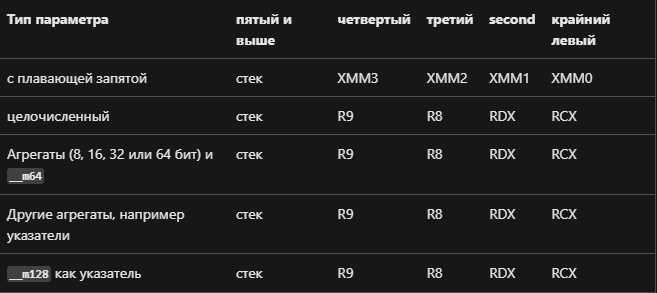

# Артемов Никита Владиславович БПИ219
## Вариант 16

Разработать программу, вычисляющую с помощью степенного ряда с точностью не хуже 0,05% значение функции e−x 
для заданного параметра x.

#### Задание решено на:
- [4-5 баллов]()
- [6 баллов]()
- [7 баллов]()
- [8 баллов]()
- [9 баллов]()

> - В программе сообщения на русском языке, потому что задание было выполнено до появления новых требований
> - Тестирование всех программ проводилось с помощью python скриптов из папки: [test-scripts](./bridge/test-scripts)
> - Все тесты лежат в папке: [tests](./bridge/tests)
> - Сравнение результатов тестов проводилось так же с помощью python скрипта (файл остался локально на ноутбуке)


## Решение на 4-5 баллов
Исходный код на C: [main.c](./bridge/main.c)
```C
#include <stdint.h>
#include <stdio.h>
#include <stdlib.h>
#include <string.h>
#include <time.h>
#include <math.h>

int getRandomNumber(long start, long end) {
    return rand() % (end + 1 - start) + start;
}

double getNumber(int argc, char* argv[]) {
    FILE* file = NULL;
    if (!strcmp(argv[1], "-f")) {
        if (argc > 2) {
            file = fopen(argv[2], "r");
        } else {
            file = fopen("in.txt", "r");
        }
        if (file == NULL) {
            printf("%s\n",
                   "Ошибка! Файл ввода не может быть открыт.\n"
                   "Файл должен существовать и быть формата txt.");
            exit(1);
        }
    }

    double number = 0;

    if (!strcmp(argv[1], "-r")) {
        number = (double)getRandomNumber(-78, 53);
    } else if (!strcmp(argv[1], "-f")) {
        fscanf(file, "%lf\n", &number);
    } else {
        scanf("%lf", &number);
    }

    if (!strcmp(argv[1], "-f")) {
        fclose(file);
        file = NULL;
    }

    return number;
}

void outputNumber(double total, int argc, char* argv[]) {
    FILE* file = NULL;
    if (strcmp(argv[1], "-c")) {
        if (argc == 4) {
            file = fopen(argv[3], "w");
        } else {
            file = fopen("out.txt", "w");
        }
    }

    if (!strcmp(argv[1], "-c")) {
        printf("%.23lf\n", total);
    } else {
        fprintf(file, "%.23lf\n", total);
    }

    if (strcmp(argv[1], "-c")) {
        fclose(file);
    }
}

double factorial(double num) {
    double res = 1;
    for (double i = 1; i <= num; i++) {
        res *= i;
    }
    return res;
}

int main(int argc, char* argv[]) {
    srand(time(NULL));
    if (argc < 2 || argc > 4) {
        printf("%s\n",
               "Вы обязаны ввести 1,2 или 3 аргумента командной строки:\n"
               "Первый - -f/-r/-c.\n"
               "Второй и третий опциональны, "
               "это абсолютный путь к файлам ввода и вывода.");
        return 0;
    }

    unsigned int start_time = clock();

    double input = getNumber(argc, argv);
    double x = fabs(input);

    double total = 1, total_temp = 0, n = 1;

    while (total - total_temp > 0.000005) {
        total_temp = total;
        total += pow(x, n) / factorial(n);
        n++;
    }

    unsigned int end_time = clock();

    printf("%s", "Время выполнения программы: ");
    printf("%.5lf", (double) (end_time - start_time) / CLOCKS_PER_SEC);
    printf("%s\n", "мс");

    outputNumber(input < 0 ? total : 1 / total, argc, argv);
    return 0;
}
```

В реализованной функции использованы функции с передачей данных через параметры, а также локальные переменные.
Связь регистров и параметров функций в языке Си: 

#### Порядок аргументов командной строки:
1. -f/-r/-с (файловый ввод и вывод / строка генерируется рандомно и выводится в файл / консольный ввод) 
— обязательный аргумент
2. <полный путь к файлу для ввода строки> — необязательный аргумент
3. <полный путь к файлу для вывода строки> — необязательный аргумент

При вводе некорректных данных - UB, поэтому требование к работе с программой - это ввод корректных данных.
Корректными данными считается целое число.
Файл для чтения или записи должен быть формата .txt, иначе - UB.

#### По умолчанию:
- ввод происходит из файла [in.txt](./bridge/in.txt)
- вывод происходит в файл [out.txt](./bridge/out.txt)
- при аргументе командной строки -r генерируется число в интервале [-78; 53].

Если ввести число меньше -78 или больше 53, то будет или inf или 0 соответственно, поэтому стоит ограничение.
Корректными данными считается число в интервале [-78; 53].

***

Исходный файл был откомпилирован без оптимизирующих и отладочных опций:
```sh
$gcc main.c -lm
```
Полученный файл: [a.out](./bridge/a.out)

А также запущен и протестирован:
```sh
$./a.out <command line arguments>
```

Результаты тестов: [tests-1](./bridge/tests/tests-1)

Исходный файл ассемблирован без оптимизирующих и отладочных опций:

```sh
$gcc -S -O0 -masm=intel main.c
```

Полученный файл: [main.s](./bridge/main.s)

В этот файл были добавлены комментарии. 
В том числе были добавлены комментарии, описывающие передачу фактических параметров и перенос возвращаемого результата и 
связь между регистрами и параметрами языка СИ.

Итоговый ассемблерный файл был откомпилирован без отладочных опций:
```sh
$gcc main.s -o b.out -lm
```
Полученный файл: [b.out](./bridge/b.out)

Получившийся файл был запущен и протестирован:
```sh
$./b.out <command line arguments>
```

Результаты тестов:  [tests-2](./bridge/tests/tests-2)

С целью избавиться от макросов файл был ассемблирован с флагом -fno-asynchronous-unwind-tables:
```sh
$gcc main.c -O0 -fno-asynchronous-unwind-tables -masm=intel -S -o without_macros.s
$gcc without_macros.s -o c.out -lm
```
Полученный файлы: 
1. [without_macros.s](./bridge/without_macros.s)
2. [c.out](./bridge/c.out)

С ними были проделаны аналогичные действия.

Результаты тестов:  [tests-3](./bridge/tests/tests-3)

> Результаты тестовых прогонов всех программ совпадают.
> Значит, они функционально эквивалентны.

---

## Решение на 6 баллов

Чтобы максимизировать использование регистров, код был ассемблирован с флагом -O2:

```sh
$gcc -O2 -fno-asynchronous-unwind-tables -masm=intel -S main.c -o with_registers.s
```

Полученный файл был отредактирован и прокомментирован: [with_registers.s](./bridge/with_registers.s)

Полученная программа также была откомпилирована, запущена и протестирована:
```sh
$gcc with_registers.s -o d.out -lm
$./d.out <command line arguments>
```

Результаты тестов: [tests-4](./bridge/tests/tests-4)

> Результаты тестовых прогонов совпадают с предыдущими.
> Значит, они функционально эквивалентны.

- Исходный код программы, полученный после компиляции с языка Си содержит 505 строк.

- Исходный код программы, модифицированной с использованием регистров содержит 431 строки.

Исходный код модифицированной программы с использованием регистров получился на 74 строки меньше.

>Модифицированная программа оказалась на ~15% короче.

---

## Решение на 7 баллов

Исходный код программы:
1. [main-split.c](./bridge/main-split.c)
2. [funcs.c](./bridge/funcs.c)
3. [funcs.h](./bridge/funcs.h)

Получаем исполняемый файл:
```sh
$gcc -c funcs.h funcs.c main-split.c
$gcc -o split.out funcs.o main-split.o -lm
```

Исполняемый файл: [split.out](./bridge/split.out)

- Использование файлового ввода-вывода описано ранее.
- Файлы, обеспечивающие тестовое покрытие находятся в папке с тестами, вместе с результатами тестов.

Результаты тестов: [tests-5](./bridge/tests/tests-5)

> Результаты тестовых прогонов совпадают с предыдущими.
> Значит, они функционально эквивалентны.

---

## Решение на 8 баллов

- Генератор случайных наборов данных добавлен и описан в предыдущих пунктах.
- Формат командной строки подстроен под возможность генерации случайных данных и описан в предыдущих пунктах.
- Функция замера времени включена в программу. Считается время сразу после ввода данных и до вывода данных.
- Время работы программы выводится в консоль в мс.

Результаты замера времени для прогона тестов: [time-tests](./bridge/tests/time-tests)
1. 0.00576 с
2. 0.00605 с
3. 0.00667 с
4. 0.00790 с
5. 0.00659 с
6. 0.00732 с
7. 0.00630 с
8. 0.00844 с
9. 0.00617 с
10. 0.00747 с
11. 0.01003 с
12. 0.00617 с

---

## Решение на 9 баллов

Ассемблируем код с использованием опций оптимизации по скорости:

```sh
$gcc main.c -Ofast -masm=intel -S -o fast.s
$gcc fast.s -o fast.out -lm
```

Получаем файл: [fast.s](./bridge/fast.s)

Размер полученной программы получился:
- эквивалентен размеру программы без оптимизаций
- на 15% больше чем в программе с регистрами

Проведены тесты на скорость работы программы:
- Время выполнения программ с регистрами и с оптимизацией по скорости в среднем эквивалентны. С оптимизацией быстрее на ~5%.
- Время выполнения не модифицированной программы в среднем больше на 25%, чем время выполнения программы с оптимизацией по скорости.

Результаты тестов: [tests-6](./bridge/tests/tests-6)

> Результаты тестовых прогонов совпадают с предыдущими.
> Значит, они функционально эквивалентны.

Ассемблируем код с использованием опций оптимизации по размеру:

```sh
$gcc main.c -Os -masm=intel -S -o size.s
$gcc size.s -o size.out -lm
```

Получаем файл: [size.s](./bridge/size.s)

Размер полученной программы получился:
- на 60 строк меньше чем в программе без оптимизаций
- на 14 строк больше чем в программе с регистрами

Проведены тесты на скорость работы программы:
- Время выполнения программ с регистрами и с оптимизацией по памяти в среднем эквивалентны (+- ~5%).
- Время выполнения не модифицированной программы в среднем больше на 5%, чем время выполнения программы с оптимизацией по памяти.
- Время выполнения программы с оптимизацией по памяти в среднем больше на 15%, чем время выполнения программы с оптимизацией по скорости.

Результаты тестов: [tests-7](./bridge/tests/tests-7)

> Результаты тестовых прогонов совпадают с предыдущими.
> Значит, они функционально эквивалентны.

---

## Итоговая программа

Получаем программу на ассемблере и исполняемый файл:
```sh
$gcc main-split.c -O2 -fno-asynchronous-unwind-tables -Ofast -Os -masm=intel -S -o main-final.s
$gcc funcs.c -O2 -fno-asynchronous-unwind-tables -Ofast -Os -masm=intel -S -o funcs-final.s

$gcc -c funcs-final.s main-final.s
$gcc -o final.out funcs-final.o main-final.o -lm
```

Исходный код файла [main-split.c](./bridge/main-split.c):
```C
#include "funcs.h"

int main(int argc, char* argv[]) {
    srand(time(NULL));
    if (argc < 2 || argc > 4) {
        printf("%s\n",
               "Вы обязаны ввести 1,2 или 3 аргумента командной строки:\n"
               "Первый - -f/-r/-c.\n"
               "Второй и третий опциональны, "
               "это абсолютный путь к файлам ввода и вывода.");
        return 0;
    }

    unsigned int start_time = clock();

    double input = getNumber(argc, argv);
    double x = fabs(input);

    double total = 1, total_temp = 0, n = 1;

    while (total - total_temp > 0.000005) {
        total_temp = total;
        total += pow(x, n) / factorial(n);
        n++;
    }

    unsigned int end_time = clock();

    printf("%s", "Время выполнения программы: ");
    printf("%.5lf", (double) (end_time - start_time) / CLOCKS_PER_SEC);
    printf("%s\n", "с");

    outputNumber(input < 0 ? total : 1 / total, argc, argv);
    return 0;
}
```

Исходный код файла [funcs.c](./bridge/funcs.c):
```C
#include "funcs.h"

int getRandomNumber(long start, long end) {
    return rand() % (end + 1 - start) + start;
}

double getNumber(int argc, char* argv[]) {
    FILE* file = NULL;
    if (!strcmp(argv[1], "-f")) {
        if (argc > 2) {
            file = fopen(argv[2], "r");
        } else {
            file = fopen("in.txt", "r");
        }
        if (file == NULL) {
            printf("%s\n",
                   "Ошибка! Файл ввода не может быть открыт.\n"
                   "Файл должен существовать и быть формата txt.");
            exit(1);
        }
    }

    double number = 0;

    if (!strcmp(argv[1], "-r")) {
        number = (double)getRandomNumber(-78, 53);
    } else if (!strcmp(argv[1], "-f")) {
        fscanf(file, "%lf\n", &number);
    } else {
        scanf("%lf", &number);
    }

    if (!strcmp(argv[1], "-f")) {
        fclose(file);
        file = NULL;
    }

    return number;
}

void outputNumber(double total, int argc, char* argv[]) {
    FILE* file = NULL;
    if (strcmp(argv[1], "-c")) {
        if (argc == 4) {
            file = fopen(argv[3], "w");
        } else {
            file = fopen("out.txt", "w");
        }
    }

    if (!strcmp(argv[1], "-c")) {
        printf("%.23lf\n", total);
    } else {
        fprintf(file, "%.23lf\n", total);
    }

    if (strcmp(argv[1], "-c")) {
        fclose(file);
    }
}

double factorial(double num) {
    double res = 1;
    for (double i = 1; i <= num; i++) {
        res *= i;
    }
    return res;
}
```

Исходный код файла [funcs.h](./bridge/funcs.h):
```C
#ifndef FUNCS_H
#define FUNCS_H

#include <stdint.h>
#include <stdio.h>
#include <stdlib.h>
#include <string.h>
#include <time.h>
#include <math.h>

int getRandomNumber(long start, long end);

double getNumber(int argc, char* argv[]);

void outputNumber(double total, int argc, char* argv[]);

double factorial(double num);

#endif /*FUNCS_H*/
```

---

- Итоговые файлы на ассемблере:
    - [main-final.s](./bridge/main-final.s) 
    - [funcs-final.s](./bridge/funcs-final.s)
- Исполняемый файл: [final.out](./bridge/final.out)
- Исходный код на ассемблере был отредактирован и прокомментирован.
- Проведены тесты - результаты совпадают с предыдущими: [tests-8](./bridge/tests/tests-8)
- ссылка на табличку сравнения времени работы программ: [time table](https://docs.google.com/spreadsheets/d/1wj04HGbjFx8joRhVZ5GJOt0rNfO8w_DWYdHq0AgctR0/edit?usp=sharing)
